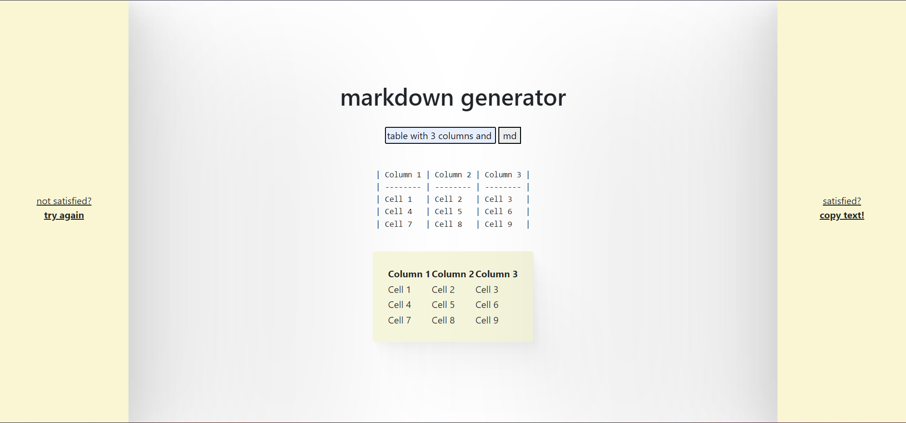

## markgen

An application to make writing markdown easier using the OpenAI API.

----

## Project Screen Shot(s)

----

## Installation and Setup Instructions

Clone this repository. You will need `node` and `npm` installed globally on your machine.  

**Installation:**

`npm install`    

To Start Server:

`npm start`  

To Visit App:

`localhost:3000/`  

----
